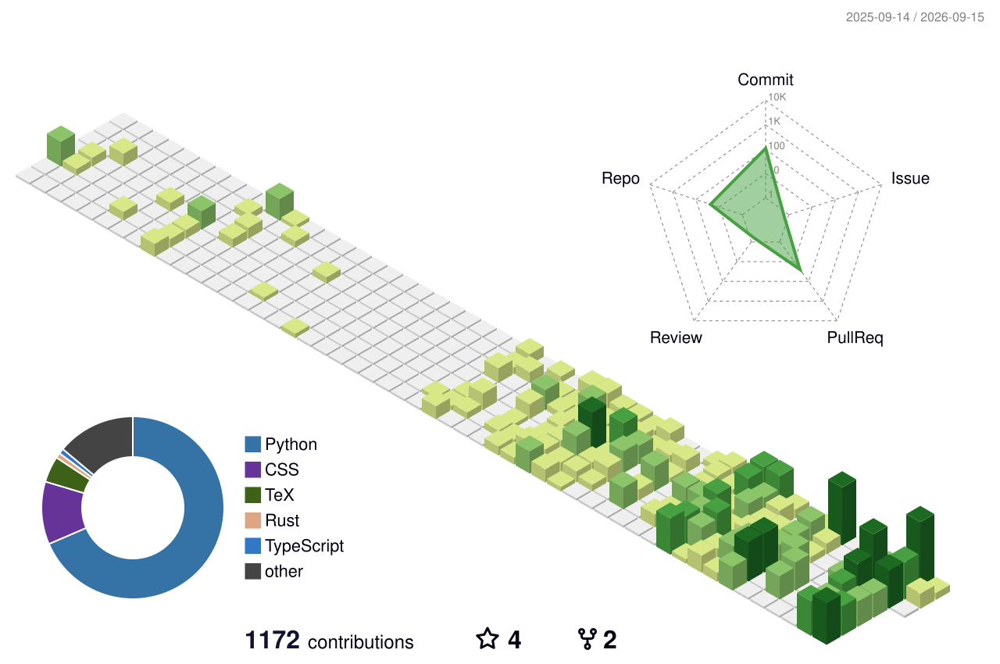

# Hi, I'm Wenqiao Kang

**Software Engineering @ Xidian University**

I build AI agents, document intelligence systems, and practical machine learning tools.

  

## About me

- Exploring **AI agents**, **RAG**, and reliable long-running workflows
- Building full-stack AI products with **Python**, **FastAPI**, and **Vue**
- Interested in computer vision, reinforcement learning, and developer tooling

## Selected work

| Project | What it does | Stack |
| --- | --- | --- |
| [EvidenceRail](https://github.com/Kangwenqiao/OpenJiuwen-Agentic-Science-Competition) | A traceable research agent that preserves evidence across long scientific workflows | Python, JiuwenSwarm, LaTeX |
| [Document Agent](https://github.com/Kangwenqiao/doc_agent_tool) | Multi-agent document analysis with probabilistic convergence, hybrid RAG, and source tracing | FastAPI, Vue 3, PostgreSQL, pgvector |
| [AIGC Rewriter](https://github.com/Kangwenqiao/LLMconfig) | An OpenAI-compatible rewriting service backed by a local Ollama model | Python, Ollama, OpenAI API |
| [RL Atari Tennis](https://github.com/Kangwenqiao/rl_gym_tennis) | A two-stage DQN training setup for Atari Tennis | Python, PyTorch, Gym |

## Toolkit

  
  
  
  
  
  
  

## 3D Contribution Calendar

  

