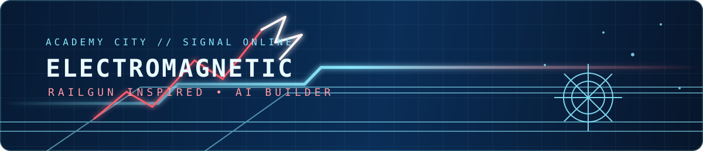

  

  <samp>Software Engineering @ Xidian University &nbsp;·&nbsp; Building AI systems that stay useful in the real world.</samp>

 

### Selected systems

[**EvidenceRail**](https://github.com/Kangwenqiao/OpenJiuwen-Agentic-Science-Competition) 
Traceable scientific agents that keep claims connected to evidence. `Python` `JiuwenSwarm`

[**Document Agent**](https://github.com/Kangwenqiao/doc_agent_tool) 
Multi-agent document analysis with hybrid retrieval and source tracing. `FastAPI` `Vue` `pgvector`

[**AIGC Rewriter**](https://github.com/Kangwenqiao/LLMconfig) 
A local, OpenAI-compatible rewriting service. `Python` `Ollama`

 

### Contributions, in depth

<picture>
  <source media="(prefers-color-scheme: dark)" srcset="https://raw.githubusercontent.com/Kangwenqiao/Kangwenqiao/output/github-contribution-grid-snake-dark.svg">
  <source media="(prefers-color-scheme: light)" srcset="https://raw.githubusercontent.com/Kangwenqiao/Kangwenqiao/output/github-contribution-grid-snake.svg">
  
</picture>

Generated daily from live GitHub activity.

